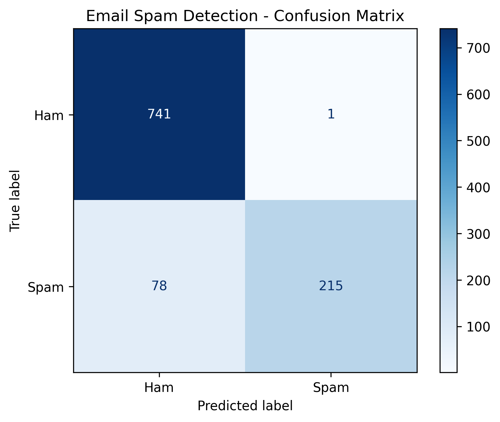

# Email Spam Detection System

A machine learning-based email spam detection system using Natural Language Processing and Naive Bayes classification algorithm.

## 📊 Project Overview

This project implements an email spam detection system that classifies emails as either "Ham" (legitimate) or "Spam" using machine learning techniques. The system uses TF-IDF vectorization for text feature extraction and a Multinomial Naive Bayes classifier for prediction.

## 🎯 Features

- **Text Preprocessing**: Automatic text cleaning and preprocessing
- **TF-IDF Vectorization**: Converts email text to numerical features
- **Machine Learning**: Uses Multinomial Naive Bayes for classification
- **Performance Metrics**: Detailed classification reports and confusion matrix
- **Visualization**: Confusion matrix plot for performance analysis

## 📈 Performance Results

- **Overall Accuracy**: 92%
- **Ham Detection**: 90% precision, 100% recall, 95% F1-score
- **Spam Detection**: 100% precision, 73% recall, 84% F1-score



## 🛠️ Technologies Used

- **Python 3.13+**
- **pandas**: Data manipulation and analysis
- **scikit-learn**: Machine learning algorithms and metrics
- **matplotlib**: Data visualization
- **TF-IDF Vectorizer**: Text feature extraction
- **Multinomial Naive Bayes**: Classification algorithm

## 📁 Project Structure

```
EMAIL/
├── spam_detector.py      # Main spam detection script
├── spam.csv             # Dataset (5,171 emails)
├── requirements.txt     # Python dependencies
├── confusion_matrix.png # Performance visualization
└── README.md           # Project documentation
```

## 🚀 Getting Started

### Prerequisites

- Python 3.13 or higher
- pip package manager

### Installation

1. **Clone the repository**
   ```bash
   git clone https://github.com/yourusername/email-spam-detection.git
   cd email-spam-detection
   ```

2. **Install dependencies**
   ```bash
   pip install -r requirements.txt
   ```

3. **Run the spam detector**
   ```bash
   python spam_detector.py
   ```

## 📝 Usage

### Running the Model

```bash
python spam_detector.py
```

The script will:
1. Load and preprocess the email dataset
2. Split data into training and testing sets (80/20)
3. Train the Multinomial Naive Bayes model
4. Generate predictions and performance metrics
5. Save a confusion matrix visualization as `confusion_matrix.png`
6. Display detailed classification report in the console

### Expected Output

```
Confusion matrix saved as 'confusion_matrix.png'
              precision    recall  f1-score   support

           0       0.90      1.00      0.95       742
           1       1.00      0.73      0.84       293

    accuracy                           0.92      1035
   macro avg       0.95      0.87      0.90      1035
weighted avg       0.93      0.92      0.92      1035
```

## 📊 Dataset Information

- **Total Emails**: 5,171
- **Features**: Email text content
- **Labels**: Ham (0) and Spam (1)
- **Split**: 80% training, 20% testing
- **Encoding**: Latin-1

## 🔧 Model Details

### Algorithm: Multinomial Naive Bayes
- **Why Naive Bayes?** 
  - Excellent performance on text classification
  - Fast training and prediction
  - Works well with high-dimensional sparse data (TF-IDF features)
  - Robust to irrelevant features

### Text Processing Pipeline
1. **Data Loading**: Load emails from CSV with proper encoding
2. **Label Encoding**: Convert 'ham'/'spam' to 0/1
3. **TF-IDF Vectorization**: 
   - Remove English stop words
   - Convert text to numerical features
   - Capture word importance across documents
4. **Model Training**: Train Multinomial Naive Bayes classifier
5. **Evaluation**: Generate predictions and performance metrics

## 📋 Requirements

```
pandas>=2.0.0
scikit-learn>=1.3.0
matplotlib>=3.7.0
```

## 🤝 Contributing

1. Fork the repository
2. Create a feature branch (`git checkout -b feature/amazing-feature`)
3. Commit your changes (`git commit -m 'Add some amazing feature'`)
4. Push to the branch (`git push origin feature/amazing-feature`)
5. Open a Pull Request

## 📄 License

This project is licensed under the MIT License - see the [LICENSE](LICENSE) file for details.

## 👨‍💻 Author

**Your Name**
- GitHub: [@yourusername](https://github.com/yourusername)
- Email: your.email@example.com

## 🙏 Acknowledgments

- Dataset source: [Specify your dataset source here]
- Inspired by email security and spam filtering research
- Built during internship project 2025

## 📚 Future Improvements

- [ ] Add support for more advanced NLP techniques (BERT, Word2Vec)
- [ ] Implement ensemble methods for better accuracy
- [ ] Add real-time email classification API
- [ ] Create web interface for user interaction
- [ ] Add more comprehensive text preprocessing
- [ ] Implement cross-validation for robust evaluation

---

⭐ **If you found this project helpful, please give it a star!** ⭐
#
